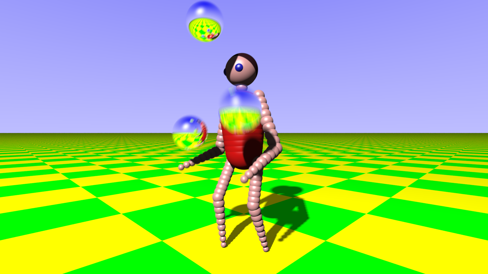

# Amiga Juggler DXR 1.1 Screen Saver

Recreates the iconic 1985 Amiga Juggler demo as a Windows screen saver (.scr) using C++ with DirectX 12 DXR 1.1 hardware ray tracing.



## Requirements

- Windows 10 version 1909+ or Windows 11
- GPU with DXR 1.1 support (NVIDIA RTX 2000+, AMD RX 6000+, Intel Arc)

## Installation

1. Download `Juggler-v1.0.0.zip` from the [latest release](../../releases/latest) and extract it to a permanent folder (e.g. `C:\Program Files\Juggler\`).
2. All files must stay together: `Juggler.scr`, `dxcompiler.dll`, `dxil.dll`, and the `shaders\` folder.

**To register with Windows Screen Saver Settings:**

Copy all extracted files into `C:\Windows\System32\`, then open *Settings → Personalization → Lock screen → Screen saver* and select **Juggler**.

**To run directly (no installation):**

```
Juggler.scr /s
```

## Usage

| Flag | Mode |
|------|------|
| `/s` | Run full-screen |
| `/c` | Configuration / about dialog |
| `/p HWND` | Preview in Settings window |

The screen saver exits on any key press or mouse movement exceeding a 5-pixel threshold.

## Building from Source

Requires Visual Studio 2022 with the C++ Desktop workload and Windows 10 SDK (10.0.26100.0 or later).

```
MSBuild Juggler.vcxproj /p:Configuration=Release /p:Platform=x64
```

Output: `build\Release\Juggler.scr` (plus `dxcompiler.dll`, `dxil.dll`, and `shaders\` in the same directory).

## Architecture

- **84 procedural spheres** + 1 ground plane rendered with analytic ray-sphere / ray-plane intersection shaders
- **Single BLAS** with 2 geometry slots (ground + spheres), rebuilt each frame
- **DXR 1.1 inline ray tracing** (`RayQuery`) for shadow and ambient occlusion
- **Iterative reflections** up to 10 bounces in the ray generation shader
- **Orbiting camera** continuously circles the juggler
- 30-frame animation cycle: cosine body oscillation, IK limbs, projectile ball physics

## Attribution

Based on the Java ray tracer by **Damian Yerrick (MeatFighter)**: [meatfighter.com/juggler](https://meatfighter.com/juggler/)

The original Java implementation provides all geometry, animation constants, material definitions, and rendering logic that this DirectX port is derived from.
